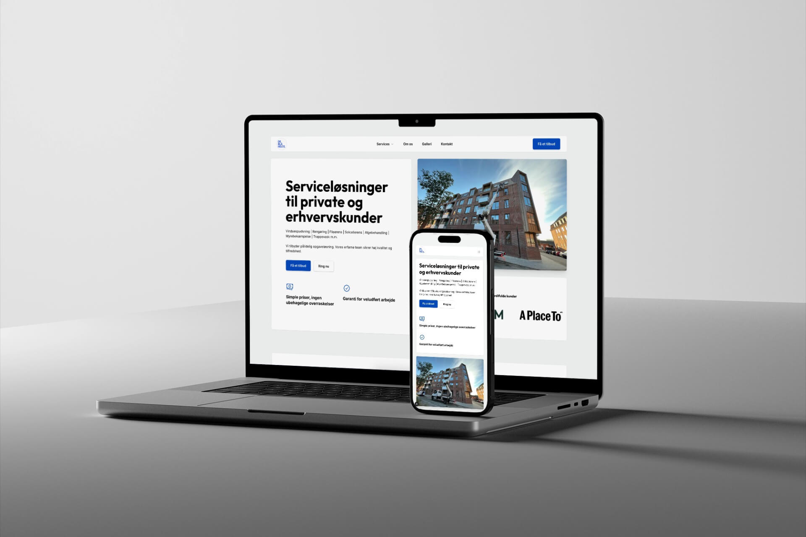

### About De Blå Helte  
De Blå Helte is a cleaning company based in Esbjerg, Denmark. As part of my Bachelor’s project, I helped them transition from their old Wix website to a more professional, flexible solution. The goal was to create a website that would require minimal ongoing developer maintenance while showcasing their services effectively.  

### Project Overview  
The website was built using the **Next.js** framework and **Sanity CMS** for content management. The project involved migrating the existing Wix site to a custom-designed solution, offering a more scalable and maintainable platform.  

### Key Features  
- **Custom Design**:  
  - Designed a fully custom, modern layout to reflect the company’s professionalism.  
- **Two Environments**:  
  - Implemented **staging** and **production** environments, each with its own dataset for better content management and smoother deployments.  
  - Deployed on **Vercel** for fast and reliable hosting.  
- **Dynamic Content**:  
  - Services, testimonials, logo clouds, case studies, and galleries were all managed via **Sanity CMS**.  
- **Get a Quote Form**:  
  - Added a form for potential clients to easily request a quote directly through the website.  
- **Minimal Maintenance**:  
  - Developed a solution that required little to no ongoing developer intervention, empowering the client to update content independently.  

### My Role  
- Migrated the website from Wix to a custom solution using **Next.js** and **Sanity**.  
- Designed and developed the custom website layout, focusing on ease of use and flexibility.  
- Implemented the deployment pipeline with **Vercel** and ensured smooth staging and production environments.  

### Outcome  
The new website provided **De Blå Helte** with a professional online presence, reducing their reliance on developers for routine content updates and showcasing their services with a sleek, modern design.  