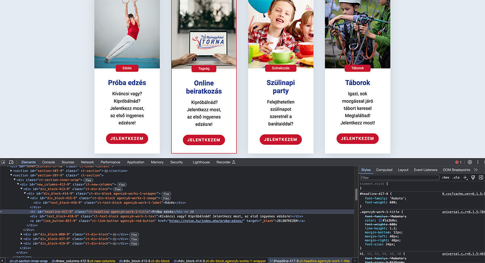

## Introduction

Looking back on my first few projects reveals just how far I've come.  This case study explores the missteps and the triumphs that ultimately shaped the way I approach development today. Let's dive into the wild world of my early projects.

### Projects mentioned in this case study

* **[NYTSE](https://nytse.hu)**
* **[CsempePiramis](https://csempepiramis.hu)**
* **[Pillér Épker](https://pillerepker.hu)** 

## My First Client Project: A Roller coaster of Chaos and Triumph

*NYTSE website source code*

### The Mistakes
* Each element had its own ID-based style, making the whole thing a mess.
* Let's just say resizing the browser window was an adventure, thanks to all those pixel-based values.

### What I learned
I learned a lot about the importance of clean, maintainable code. After this experience, I was all about creating reusable classes and components. It saved me tons of headaches in future projects. 
