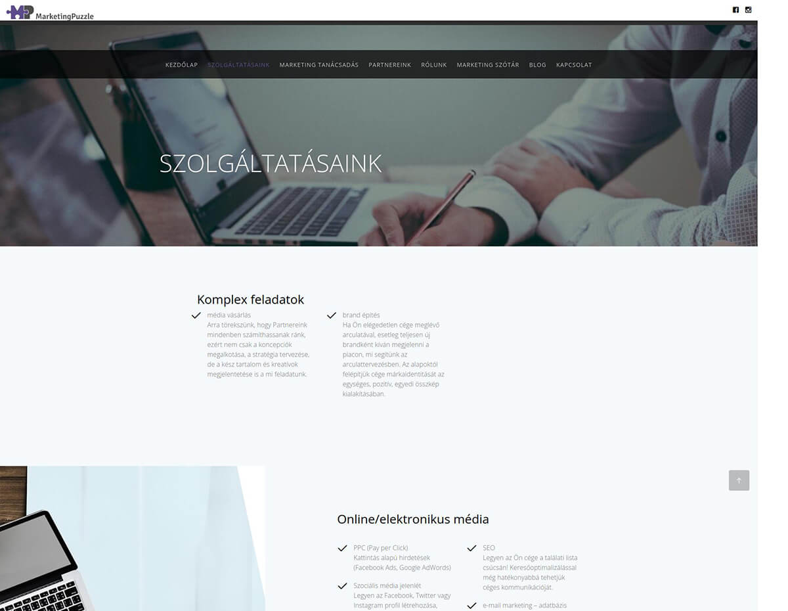

## Introduction

  In today's digital world, a website is often a potential client's first impression of a business. <a href="https://marketingpuzzle.hu/" target="_blank">Marketing Puzzle</a>
  , a
Hungarian marketing powerhouse, was struggling with an outdated website that no longer reflected their brand's
innovation and capabilities. Their online presence failed to capture their expertise and the cutting-edge solutions they
provide to clients. Slow loading pages, an old-school design, and a lack of essential functionalities like a content
management system (CMS) were hindering their ability to engage their target audience. The outdated look and feel were
not up to today's standards, negatively impacting their ability to attract new business.

*The old Marketing Puzzle website above the fold section*

## My role & Objectives

As the main developer behind the project, I was responsible for the entire website creation process, from the backend
setup to the frontend development and design. My primary goals were:

* **Performance:** To code a fast, performant website with CMS functionalities to empower the Marketing Puzzle team to
  manage their website content with ease
* **User Experience:** To implement a simple and minimal design, incorporating illustrations to enhance the visual
  appeal
  and create a modern and user-friendly experience.

## Process & Solutions

* **Design**:  I began by researching modern website design trends and best practices for marketing agencies.
  Collaborating with the Marketing Puzzle team, I created a visual style that aligned with their brand, emphasizing
  clean lines, bold typography, and illustrations to add a touch of personality.
* **Technology**: I selected WordPress as the foundation for its powerful content management capabilities and widespread
  familiarity. To ensure full customization and performance, I developed a custom theme from scratch. Tailwind CSS
  provided a streamlined development experience for the frontend, allowing for a responsive and visually appealing
  design. Vanilla JavaScript was used for interactive elements like the hamburger menu, keeping the site lightweight and
  user-friendly.

* **Performance Optimization:**: Throughout development, I emphasized image compression, code minification, and
  efficient asset loading to ensure a fast experience for site visitors. Cloudways was selected as the hosting provider
  for its scalability and performance-oriented infrastructure. Additionally, I implemented Cloudflare Enterprise CDN to
  further accelerate content delivery globally.

## Results

While comprehensive performance data for the new website requires more time for analysis, the positive impact for
Marketing Puzzle is already evident:

* **Empowered Content Management:** The updated website's user-friendly CMS has streamlined content creation and
  publishing for the client's team. This translates to increased efficiency and the ability to share news, insights, and
  updates more frequently.
* **Improved Brand Perception:** The modern design and enhanced performance of the new website project a contemporary
  and professional image. Marketing Puzzle can confidently utilize their website as a central marketing asset in social
  media and Google Ads campaigns.
* **Laying the Foundation for Future Success:** While detailed metrics take time to accumulate, the essential
  optimizations implemented have created a strong foundation for future growth. As the website gains visitors, the data
  gathered will be invaluable in fine-tuning the website's performance and driving measurable results.

**Stay Tuned:** We'll be monitoring the website's performance closely in the coming months and will update this case
study with concrete metrics on traffic increases, lead generation, and other key performance indicators.
