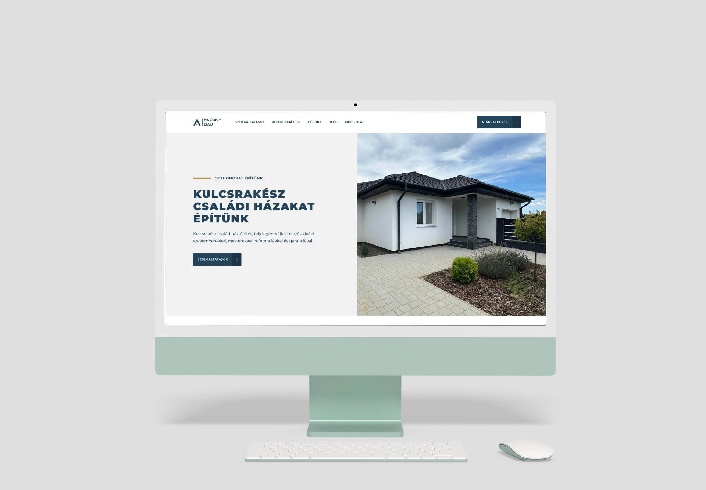

### About PazonyBau  
PazonyBau is a construction company based in Eastern Hungary, specializing in building new houses. They lacked an online presence and needed a professional website to showcase their expertise and services.  

### Project Overview  
The goal of the project was to design and develop a website from scratch that would reflect the company’s professionalism while being easy to update. The stack used for this project was **Vue**, **Nuxt**, and **Storyblok CMS**.  

### Key Features  
- **Dynamic Content Management**:  
  - Showcased completed houses, houses under construction, testimonials, and services.  
  - Fully managed using **Storyblok CMS** for ease of updates.  
- **Get a Quote Form**:  
  - A dedicated form allowing potential customers to request a quote directly through the website.  
- **Image Galleries**:  
  - High-quality image galleries for completed and in-progress projects.  
- **Responsive Design**:  
  - Optimized for both desktop and mobile devices, ensuring a seamless user experience.  

### My Role  
- Designed the website layout and user experience from scratch.  
- Developed the site using **Nuxt** for server-side rendering and seamless navigation.  
- Integrated **Storyblok CMS** to allow the client to manage dynamic content effortlessly.  

### Outcome  
The final website provided PazonyBau with a professional online presence, effectively showcasing their expertise and helping attract new clients through a user-friendly design and dynamic content features.  
