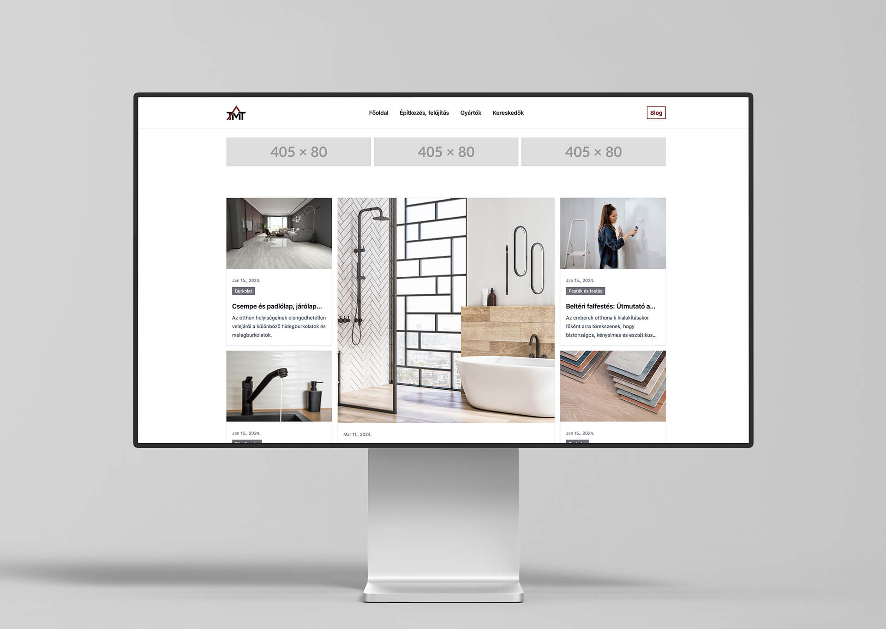

## My Role & Objectives

On the website, I played a key role in crafting user experience and functionality. I focused on building the homepage to
showcase articles and implemented an interactive map displaying retailers across Hungary. My primary goals were:

- **A Compelling First Impression:** My primary objective was to design and develop the homepage, ensuring a visually
  appealing and intuitive layout with a seamless user journey for exploring content.
- **Performance Optimization:** I was tasked with optimizing the website's performance for a smooth user
  experience, including efficient coding practices to ensure fast loading times. Additionally, I focused on optimizing
  the interactive map functionality for minimal impact on overall website performance.

## Process & Solutions

- **Content Management Made Easy:** Recognizing the need for ongoing content updates, the website is built on WordPress,
  empowering the Több Mint Tüzép team to effortlessly manage and update their content.
- **Custom Tailored Design & Performance:** To achieve the desired level of flexibility and performance, the website is
  built on a custom theme from the ground up.
- **Utility-First Development:** Tailwind CSS streamlined the development process, ensuring a responsive and visually
  engaging design.
- **Conquering the Map Challenge:** A key feature was showcasing retailers across Hungary on an interactive map. I
  implemented the Mapbox GL JS API, enabling real-time updates by cleverly connecting retailer data stored within the
  WordPress admin panel to the map itself.

## Results

The website of Több Mint Tüzép is a dynamic project constantly evolving. While the platform is live and readily
accessible to users, it's on an exciting journey of continuous content creation and feature development.

- **Long-Term Strategy:** While the full impact of Több Mint Tüzép is yet to be fully measured, the project has been a
  rewarding learning experience and a testament to my ability to contribute to a growing online platform.
- **A Dynamic & Engaging Platform:** Több Mint Tüzép transformed into an online magazine, offering informative articles,
  tips, and inspiration.
- **Integrated Sales Interfaces:** Retailers and manufacturers can now leverage the platform to showcase their products
  and
  services, reaching a targeted audience of potential customers.
- **Simple Content Management:** The user-friendly WordPress CMS empowers the Több Mint Tüzép team to manage and update
  website content with ease.
- **Stay Tuned:** This is just the beginning! We're continuously monitoring the website’s performance, and will back
  with concrete data on traffic growth, lead generation, and other key metrics in the future.
